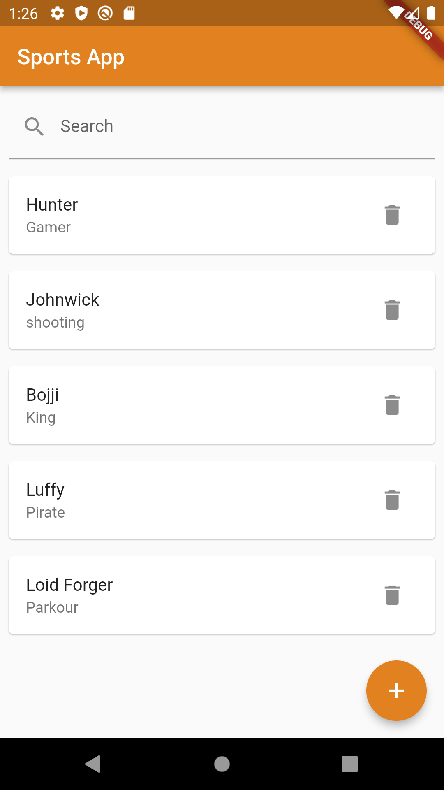
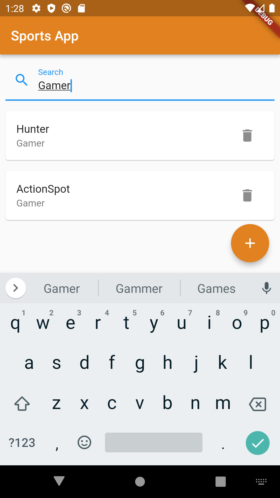
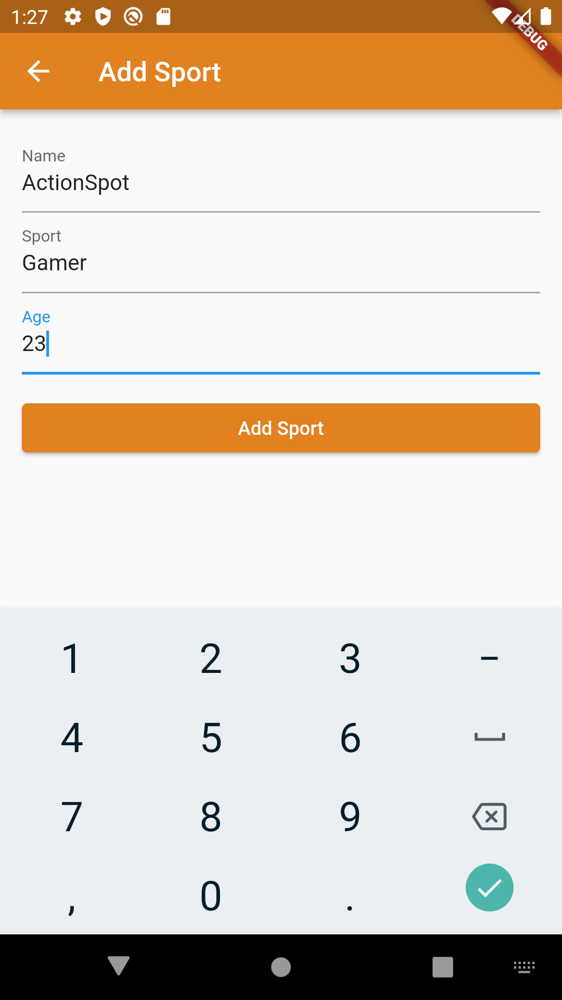
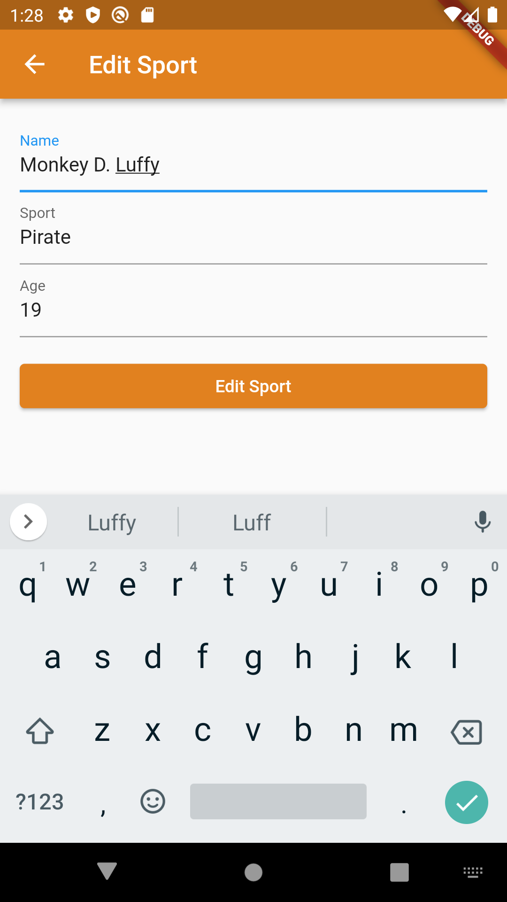

# Sports App

Welcome to the Sports App repository! This Flutter app allows users to manage and track sports-related information using a local SQLite database. The app features three main screens for viewing, adding, and editing sports data.

## Table of Contents

- [Features](#features)
- [Screenshots](#screenshots)
- [Getting Started](#getting-started)
- [Dependencies](#dependencies)
- [Usage](#usage)
- [Contributing](#contributing)
- [License](#license)

## Features

- View a list of sports with options to search, edit, and delete.
- Add new sports with details such as name, sport, and age.
- Edit existing sports to update their information.
- Local SQLite database for data persistence.

## Screenshots

*Main Screen displaying the list of sports with search functionality.*

*Main Screen displaying the list of sports when searching .*

*Add Screen for adding a new sport to the database.*

*Edit Screen for modifying the details of an existing sport.*

## Getting Started

To run this project locally, follow these steps:

1. Clone the repository: `git clone https://github.com/huntoor/sports_app`
2. Navigate to the project directory: `cd sports_app`
3. Install dependencies: `flutter pub get`
4. Run the app: `flutter run`

## Dependencies

- Flutter
- sqflite
- path

For detailed information about dependencies, refer to the `pubspec.yaml` file.

## Usage

- Launch the app on your device or simulator.
- Explore the main screen to view, search, edit, and delete sports.
- Use the "Add Sport" button to add a new sport with relevant details.
- Navigate to the "Edit Sport" screen to modify the information of an existing sport.

## Contributing

Contributions are welcome! Feel free to open issues or pull requests for any improvements or bug fixes.

1. Fork the repository
2. Create your feature branch: `git checkout -b feature/new-feature`
3. Commit your changes: `git commit -m 'Add new feature'`
4. Push to the branch: `git push origin feature/new-feature`
5. Open a pull request

## License

This project is licensed under the [MIT License](LICENSE).
